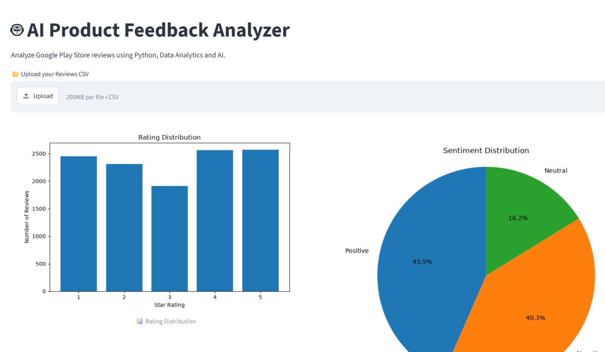
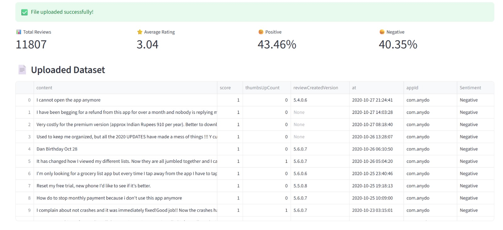
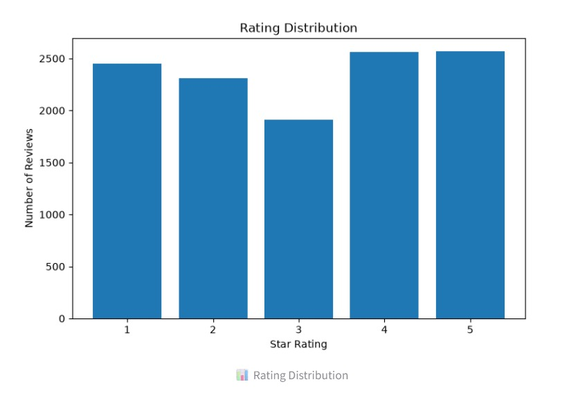
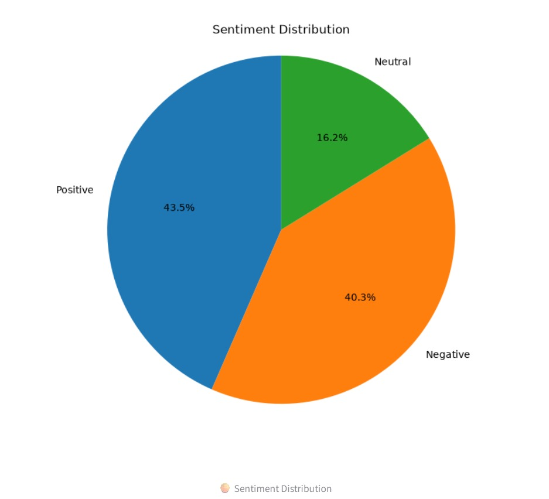
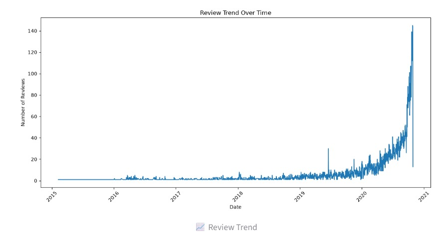
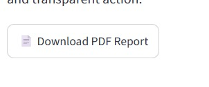

# 🤖 AI Product Feedback Analyzer

## 📌 Overview

AI Product Feedback Analyzer is an AI-powered web application that helps businesses analyze customer reviews from Play Store or App Store datasets.

The application automatically performs:

- Rating Analysis
- Sentiment Analysis
- Data Visualization
- AI-powered Product Insights
- Report Generation

---

# ✨ Features

✅ Upload CSV Reviews

✅ Dashboard Metrics

✅ Rating Distribution

✅ Sentiment Analysis

✅ Review Trend Analysis

✅ Top Frequent Words

✅ Google Gemini AI Insights

✅ Download PDF Report

---

# 🛠️ Tech Stack

- Python
- Streamlit
- Pandas
- Matplotlib
- Google Gemini API
- ReportLab

---

# 📁 Project Structure

```text
AI_Product_Feedback_Analyzer

│

├── app.py

├── requirements.txt

├── README.md

├── data

├── utils

├── charts

├── reports

├── screenshots

└── assets
```

---

# 🚀 Installation

Clone repository

```bash
git clone https://github.com/IshwariPatil06/AI-Product-Feedback-Analyzer
```

Open folder

```bash
cd AI-Product-Feedback-Analyzer
```

Install packages

```bash
pip install -r requirements.txt
```

Run

```bash
streamlit run app.py
```

---

# 📸 Project Screenshots

### Dashboard



### Metrics



### Rating Distribution



### Sentiment Analysis



### Review Trend



### AI Insights


### PDF Report Generation



---

# 🌐 Live Demo

https://ai-appuct-feedback-analyzer-hrjiynfigzeompn3wsgww4.streamlit.app/

---

# 👨‍💻 Author

Ishwari Patil

First-Year Computer Science Student

Interested in Artificial Intelligence, Data Analytics, and Software Development.